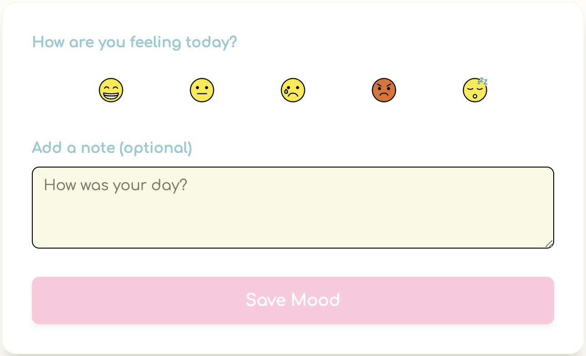

# Mood Tracker 😃📅

A cozy, modern mood tracker app built with **React + TypeScript + Vite + Tailwind CSS**.
Track your daily moods, add notes, and visualize your emotional trends on a beautiful calendar!

[](https://mood-tracker-zepr.onrender.com)



---

## ✨ Features

- **Emoji-based mood selection** (custom SVGs)
- **Colorful, responsive calendar** with mood icons
- **Add notes** to each day
- **Edit and delete** mood entries
- **Mood filtering** (see only selected moods)
- **Mood statistics** and **trend chart** (Chart.js)
- **Mobile-friendly** and super cozy UI (Comfortaa font)
- **Polished animations** and pastel color palette

## 🚀 Quick Start

1. **Clone the repo:**
   ```bash
   git clone https://github.com/Aquinnos/mood-tracker.git
   cd mood-tracker
   ```
2. **Install dependencies:**
   ```bash
   npm install
   ```
3. **Run the app locally:**
   ```bash
   npm run dev
   ```
4. Open [http://localhost:5173](http://localhost:5173) in your browser.

## 🛠️ Tech Stack

- [React](https://react.dev/)
- [TypeScript](https://www.typescriptlang.org/)
- [Vite](https://vitejs.dev/)
- [Tailwind CSS](https://tailwindcss.com/)
- [Chart.js](https://www.chartjs.org/) + [react-chartjs-2](https://react-chartjs-2.js.org/)
- [date-fns](https://date-fns.org/)

## 🌍 Online Demo

Check out the live demo: [https://mood-tracker-zepr.onrender.com](https://mood-tracker-zepr.onrender.com)

## 👥 Authors

- [Krystian Synakowski](https://github.com/Aquinnos)

## 🏆 Hackathon

This project was created for the [CodeCircuit](https://www.codecircuit.ai/) 🚀

## 📄 License

MIT
